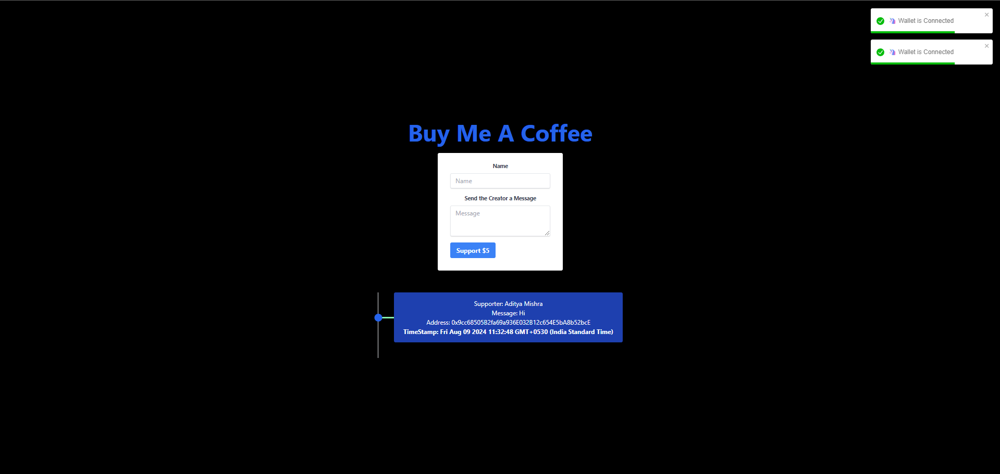

# Buy Me a Coffee dApp

This project is a decentralized application (dApp) built with the following technologies:

* **Solidity:** Smart contract development language for defining the logic behind the "Buy Me a Coffee" functionality.
* **Hardhat:** Development framework for building, testing, deploying, and debugging Ethereum smart contracts.
* **Ethers.js:** JavaScript library for interacting with the Ethereum blockchain from the frontend.
* **Next.js:** React framework for building a smooth and interactive frontend experience.
* **Tailwind CSS:** Utility-first CSS framework for building responsive and stylish user interfaces.

This dApp allows users to send cryptocurrency directly to the developer's wallet address as a token of appreciation for their work. The transaction is recorded on the Ethereum blockchain, ensuring transparency and immutability.



## Features

* Users can enter their name and a message to accompany their coffee purchase.
* The dApp displays a list of previous contributors with their names, messages, and timestamps.
* The smart contract safely holds the donated funds.

## Getting Started

### Prerequisites

* Node.js (version 14 or later) and npm (or yarn) installed on your system.
* MetaMask wallet or a similar Ethereum wallet extension.

### Installation

1. Clone the repository:

   ```bash
   git clone https://github.com/mishraji874/BuyMeACoffee-dApp.git
   ```

2. Navigate to the project directory:

   ```bash
   cd BuyMeACoffee-dApp
   ```

3. Install dependencies:

   ```bash
   npm install
   ```

### Environment Setup

1. Create a `.env` file at the root of the project.
2. Add your Ethereum wallet private address and endpoint RPC URL to the `.env` file:

   ```
   RPC_URL = your_endpoint_rpc_url
   PRIVATE_ADDRESS = your_wallet_private_address
   ```

### Running the Development Server

1. Go to the `client` folder using the below command:
   
   ```bash
   cd client
   ```

2. Then, install all of the nextjs and tailwind dependencies:
   
   ```bash
   npm i
   ```

3. Start the development environment:

   ```bash
   npm run dev
   ```

4. Open http://localhost:3000 in your web browser to access the dApp.
   
### Important Note

If you want to build your dapp like this then you have to take the money on your account so you have to add your account and deploy the smart contract with your account in which you have to follow the below instructions:

1. First, create the `.env` file from the above given steps.
2. Then, run the following command:
   
   ```bash
   npx hardhat run scripts/deploy.js --network <YOUR_NETWORK_NAME>
   ```
3. After deploying the contract, copy the contract address and paste it into the `client/pages/index.js` and replace it with the `contractAddress` variable.

### Deployment

**Note:** Deploying the smart contract requires familiarity with Hardhat and a blockchain network (e.g., Ethereum Mainnet, Rinkeby Testnet).

1. Configure Hardhat for your desired network.
2. Compile and migrate the smart contract.

**Disclaimer:** Deploying to a mainnet requires real ETH for gas fees. Consider deploying to a testnet environment for development purposes.